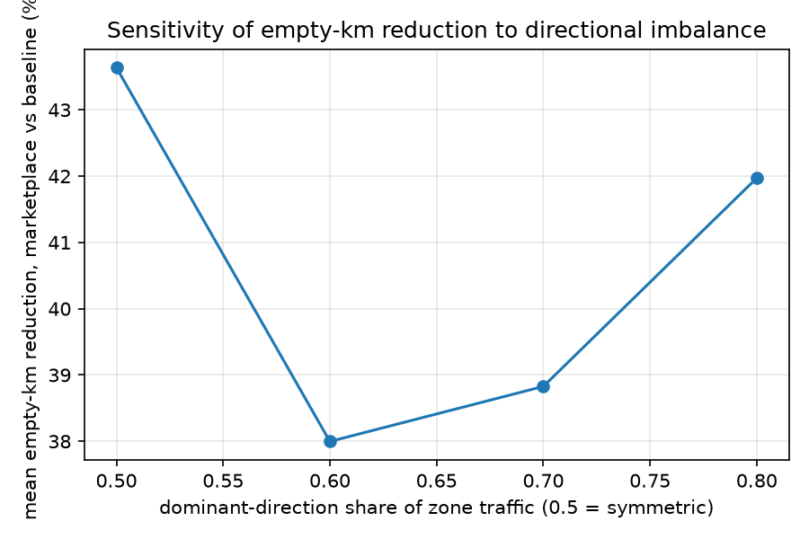

# Agent-to-Agent Freight Marketplace (simulation)

Stage 0: simulator skeleton, data model, and baseline metrics. No AI yet.

## Setup

```
python -m venv .venv
.venv/Scripts/python -m pip install -r requirements.txt
```

Fetch and cache the road network once (real OpenStreetMap data for the
Peenya / Bommasandra / Hosur / Whitefield industrial region; ~240k nodes,
~600k edges, downloaded via Overpass and cached to `data/cache/`):

```
PYTHONPATH=src .venv/Scripts/python scripts/fetch_network.py
```

Run the tests (fast; these use a straight-line fake network, not the real
cached graph, so they don't require the fetch step above):

```
.venv/Scripts/python -m pytest tests/ -q
```

Run the Stage 0 scenario comparison (uses the real cached road network; the
first run pays a one-time route-caching cost of a few minutes, see
"Performance" below):

```
PYTHONPATH=src .venv/Scripts/python scripts/run_scenarios.py
```

Run every sanity check from the Results section below in one process (shares
one route-cache warm-up instead of paying it once per script):

```
PYTHONPATH=src .venv/Scripts/python scripts/run_stage0_diagnostics.py
```

## Project layout

```
config/default.yaml      all tunable numbers -- nothing in src/ hardcodes one
src/freight_sim/
  models.py               Truck, Load, Deal -- public/platform/private tiers
  events.py               EventType enum, Event, EventLog (JSONL writer/reader)
  clock.py                fixed sim epoch, no datetime.now() anywhere
  config.py               pydantic config schema + config_hash for traceability
  geo.py                  haversine (marketplace's coarse candidate screen)
  network.py              OSMnx road network wrapper, with route caching
  demand.py                fleet + load generation, with directional imbalance
  matching.py             propose_candidates (coarse) / verify_match (optimiser)
  simulator.py            the discrete-event loop tying it together
  metrics.py              fleet-wide metrics computed from the event log, never live state
  zone_metrics.py         per-zone/per-truck breakdowns (imbalance shows up in the
                          distribution, not the fleet-wide mean -- see README)
scripts/
  fetch_network.py            one-off: download + cache the road network
  run_scenarios.py            baseline vs rule-based vs broker-commission
  check_demand_imbalance.py   sanity check: does demand match the configured imbalance?
  run_seed_sweep.py           variance of the headline result across 20 seeds
  run_imbalance_sweep.py      fleet-wide-mean sensitivity to the imbalance ratio (flat -- see README)
  run_zone_imbalance_sweep.py per-zone sensitivity to the imbalance ratio (not flat)
  diagnose_veto_rate.py       why DETOUR_LIMIT dominated vetoes, and whether the fix worked
  run_stage0_diagnostics.py   all of the above in one process (one route-cache warm-up)
  imbalance_sweep_utils.py    shared apply_skew() helper
tests/                    pytest, using a fake straight-line network for speed;
                          test_privacy.py guards the public/platform/private split
```

## Data model

**Visibility tiers**, enforced by convention (agent-facing code must only read
the tier(s) that agent is allowed to see):

- `Truck.public` -- static vehicle facts (capacity), visible to everyone
- `Truck.platform` -- dynamic state (location, status, spare capacity),
  visible to the marketplace agent only -- competing truckers must not see
  this, or later collusion/observation experiments are meaningless
- `Truck.private` -- costs, reservation price, personal constraints; visible
  only to the truck's own agent, never reaches the marketplace
- `Load.public` / `Load.private` -- a load board posting is public by design;
  only the shipper's true reservation price and late penalty are private

The event log is a separate, *omniscient* concern: it may carry private
fields (e.g. `TRUCK_SPAWNED` carries a truck's cost structure), because it is
the simulator's own record used for metrics and replay, not a channel
between agents.

`tests/test_privacy.py` guards this split behaviorally, not just by naming
convention: it hands `propose_candidates` (the marketplace's coarse screen)
and `verify_match` (the optimiser) a tripwire object in place of the tier
they must not read, which raises immediately if any field on it is ever
accessed. Worth having settled before Stage 2 introduces real agents that
could otherwise quietly depend on a leak.

`Deal` holds final agreed terms only. Negotiation history (Stage 2+) will
live in the event log under a `negotiation_id`, not on the `Deal` itself --
this keeps the schema stable as later stages add real back-and-forth.

## Event types

17 event types. `seq` is a monotonic per-run counter (multiple events can
share a `sim_time`) and `schema_version` lets later stages replay Stage 0 logs.

| Event | Notes |
|---|---|
| `SIM_STARTED` / `SIM_ENDED` | carries seed + full config snapshot for traceability |
| `TRUCK_SPAWNED` | carries the truck's private cost params, so the log is self-sufficient for metrics |
| `LOAD_POSTED` / `LOAD_EXPIRED` | |
| `MATCH_PROPOSED` | the marketplace's coarse screen (public/platform info only); carries `screening_distance_km` (straight-line) for comparison against the optimiser's real distance |
| `MATCH_VERIFIED` / `MATCH_VETOED` | the optimiser's full-information check; veto reasons: `TIME_WINDOW`, `CAPACITY`, `DETOUR_LIMIT`, `HOME_DEADLINE`; both carry `detour_km` (real road distance) and `max_detour_km` (the truck's own threshold) so the coarse screen can be calibrated against reality -- see `diagnose_veto_rate.py` |
| `DEAL_CREATED` / `DEAL_COMPLETED` / `DEAL_FAILED` | `DEAL_FAILED` is reserved -- Stage 0 has no breakdowns/no-shows yet |
| `TRUCK_DEPARTED` / `TRUCK_ARRIVED` | `purpose`: `delivery`, `reposition_to_pickup`, `deadhead_home` (`speculative_reposition` reserved) |
| `TRUCK_WAIT_STARTED` / `TRUCK_WAIT_ENDED` | away from home, holding out for a load -- counts toward the waiting-time metric |
| `TRUCK_IDLE_STARTED` / `TRUCK_IDLE_ENDED` | at home, nothing scheduled -- does **not** count toward waiting time |

## Stage 0 scenarios

Same seed, same trucks/loads/timings across all three runs:

- **`baseline_no_marketplace`** -- trucks still get an ordinary job when
  idling at home (that's not what a marketplace changes), but once away from
  home there is no marketplace to find a *return* load, so every truck
  deadheads straight home after one delivery. This isolates the empty-return
  problem specifically, rather than making the baseline do zero freight at all.
- **`rule_based_marketplace`** -- the same matching machinery is available at
  every decision point, so a truck can chain into another load instead of
  deadheading.
- **`broker_commission`** -- identical matching to rule-based, but a
  commission is taken out of the trucker's earnings (shipper cost is
  unaffected).

### Results

_Numbers below are relative comparisons on synthetic demand, per the
project's stated goal of structural realism, not absolute rupee accuracy.
Seed 42, 40 trucks, 7 simulated days (+48h buffer for in-flight trips). The
marketplace's coarse-screen distance was recalibrated from 25km to 15km
based on the veto diagnosis below -- these numbers reflect that fix._

| scenario | deals completed | backhaul deals | deadhead trips | match vetoed | empty km | laden km | loaded-return share | fuel (L) | waiting (h) | idle (h) | trucker earnings | broker revenue | shipper cost |
|---|---|---|---|---|---|---|---|---|---|---|---|---|---|
| baseline (no marketplace) | 163 | 0 | 163 | 70 | 6349.2 | 6075.4 | 0.000 | 2632.2 | 0.0 | 3052.0 | 78,258 | 0 | 78,258 |
| rule-based marketplace | 154 | 30 | 121 | 80 | 4599.2 | 5664.7 | 0.199 | 2154.8 | 1550.4 | 2077.0 | 72,760 | 0 | 72,760 |
| broker commission (10%) | 154 | 30 | 121 | 80 | 4599.2 | 5664.7 | 0.199 | 2154.8 | 1550.4 | 2077.0 | 65,484 | 7,276 | 72,760 |

Reading this: `loaded-return share` only counts a match made while a truck is
*away from home* (a real backhaul) against a deadhead -- it deliberately
excludes at-home dispatch, which both scenarios do identically. An earlier
version of this metric compared *all* completed deals (including at-home
ones) against deadheads, which in the baseline is tautologically pinned at
0.5 by construction (every baseline delivery is followed by exactly one
deadhead) and told you nothing real. With the fix, baseline correctly reads
0.000 -- literally zero backhauls with no marketplace -- versus 0.199 with
one, which is the actual, meaningful number.

Reproduce with `PYTHONPATH=src .venv/Scripts/python scripts/run_stage0_diagnostics.py`
(runs this table plus every check below in one process).

### Sanity checks on these numbers

A single seed, a single imbalance setting, an under-calibrated filter, and a
metric that turned out to be tautological are exactly the kind of thing that
would have quietly made every later comparison look better than it is. Five
checks before trusting any headline number out of this simulator:

**1. Seed variance.** Seed 42 alone is not informative. Across 20 seeds
(`scripts/run_seed_sweep.py`, recalibrated filter):

- mean **40.1%**, stdev **6.5pp**, range **27.6% - 52.3%**
- seed 42's 27.6% happens to be the *lowest* of the 20 again -- **use the mean
  ± stdev (40.1% ± 6.5pp), never a single seed.**

**2. Directional imbalance is real, not symmetric.** Over a 7-day run
(`scripts/check_demand_imbalance.py`), observed outbound:inbound totals per
zone:

| zone | outbound | inbound | ratio |
|---|---|---|---|
| Peenya | 75 | 20 | 3.75 : 1 |
| Bommasandra | 59 | 19 | 3.11 : 1 |
| Hosur | 31 | 48 | 0.65 : 1 |
| Whitefield | 19 | 97 | 0.20 : 1 |

Peenya and Bommasandra genuinely ship 3-4x what they receive; Whitefield
receives ~5x what it ships. Hosur was configured symmetric but still comes
out as a net *importer* (31 vs 48) -- an emergent side effect of destination
selection being weighted by every zone's inbound rate (see `demand.py`), not
a bug, but worth knowing: no zone in this generator is ever perfectly neutral
in practice.

**3. The aggregate imbalance sweep is flat -- but that turned out to be the
wrong place to look.** Sweeping Peenya/Bommasandra/Whitefield's
dominant-direction share from 50:50 (symmetric) to 80:20 and measuring the
*fleet-wide mean* empty-km reduction gave a flat curve (43.6% / 38.0% / 38.8%
/ 42.0%, `scripts/run_imbalance_sweep.py`, chart at `data/imbalance_sweep.png`,
run before check 5's coarse-filter recalibration) -- within noise of check 1's
spread. Read at face value, that would mean the
marketplace's benefit has nothing to do with directional imbalance
specifically. **It doesn't mean that; it means the aggregate mean is the
wrong statistic.** See check 4.



**4. Distributional check -- the imbalance effect is real, large, and exactly
where predicted.** Run after check 5's coarse-filter recalibration (so its
numbers aren't directly comparable to check 3's pre-fix ones, but the
exporter/importer *gap* this checks for is a within-run comparison and isn't
sensitive to that). Prediction, written down before running
(`scripts/run_zone_imbalance_sweep.py` / Part 4 of
`run_stage0_diagnostics.py`): *under 80:20, trucks stranded in Whitefield
(net importer) should have a substantially lower backhaul success rate than
trucks stranded in Peenya (net exporter), and that gap should shrink toward
zero at 50:50.*

| skew | Peenya backhaul-success rate | Whitefield backhaul-success rate | gap | Peenya home-zone earnings | Whitefield home-zone earnings |
|---|---|---|---|---|---|
| 50:50 | 47.6% | 44.5% | 3.0pp | 6,700 | 4,942 |
| 60:40 | 55.3% | 25.0% | 30.3pp | 7,602 | 4,585 |
| 70:30 | 69.0% | 11.9% | 57.2pp | 7,726 | 4,703 |
| 80:20 | 77.8% | 3.9% | 73.9pp | 7,934 | 4,560 |

**The prediction held, dramatically.** The gap widens monotonically from
essentially nothing at symmetric demand to 74 percentage points at 80:20.
Whitefield's load-expiry rate for its own (few) outbound loads also drops to
0% as skew increases -- every truck stranded there is competing for the same
handful of loads home. Peenya's expiry rate *rises* with skew (7.5% ->
24.2%) because it generates more outbound supply than the fleet passing
through can absorb. **Check 3's flat aggregate curve was an artifact of
averaging over a fleet where different trucks (grouped by home zone) are
affected in opposite, largely canceling ways** -- exporter-zone trucks get
better off, importer-zone trucks get worse off, and the fleet-wide mean
barely moves. The simulator is correctly responsive to imbalance; the
fleet-wide empty-km mean was simply never the statistic that would show it.
**Report zone-level or distributional metrics for imbalance-sensitivity
claims going forward, not the fleet-wide mean.**

#### Named finding: this project now has two separate results, not one

**The efficiency story** (checks 1 and 3): aggregate empty-km reduction is
~27-52% depending on seed (mean 40.1% ± 6.5pp) and is roughly
**imbalance-independent** -- it holds even under fully symmetric demand,
because it's mostly driven by generic backhaul chaining, not by fixing
imbalance-caused stranding specifically.

**The equity story** (check 4): who *captures* that efficiency gain is
**highly imbalance-dependent**. As imbalance grows, the benefit concentrates
on trucks already based in well-placed (exporter) zones -- their backhaul
success rate and earnings both rise with skew -- while trucks stranded in
importer zones see their backhaul odds collapse toward zero and their
earnings stagnate. At 80:20, a Peenya-based truck finds a backhaul 78% of the
time it needs one; a Whitefield-based truck finds one 4% of the time.

These are not the same claim, and a report that only quotes the fleet-wide
mean would miss the second, arguably more important one entirely. It also
connects directly to why this project's later stages (trucker coalitions,
Shapley-value splits, fairness mechanisms) matter and aren't just add-ons: an
unmanaged marketplace that only optimizes aggregate efficiency will, by this
evidence, leave whichever truckers are structurally based in net-importer
areas worse off relative to their exporter-zone peers as imbalance increases
-- a fairness problem the aggregate metric alone would never surface.

**5. Veto rate diagnosis: was the coarse filter too loose, or was
`max_detour_km` too tight?** Before the fix, `DETOUR_LIMIT` accounted for 77%
of all vetoes (`scripts/diagnose_veto_rate.py`). Diagnosis:

- the marketplace's coarse screen only checks straight-line distance against
  a flat, network-wide `max_candidate_detour_km` (25km); real road distance
  in this network runs **1.3-1.9x** the straight-line distance
- for vetoed candidates, the *median straight-line screening distance alone*
  (18.5km) already exceeded the *median vetoed truck's own private
  threshold* (16.2km) -- before any road inflation was even applied
- **conclusion: hypothesis (a)** -- the coarse filter was proposing pairs
  real roads (and often even straight-line distance) were never going to let
  through. Fixed by recalibrating `max_candidate_detour_km` from 25km to
  15km, using the measured inflation factor (this stays a legitimate
  network-wide calibration; it does not require -- or use -- any truck's
  private threshold). Result: total vetoes dropped from 314 to 80 (a 75% cut
  in wasted `verify_match` calls), and `DETOUR_LIMIT`'s share of vetoes
  dropped from 77% to 2.5%; `HOME_DEADLINE` is now the dominant reason (92.5%).

To check hypothesis (b) as well, `scripts/run_stage0_diagnostics.py` (Part 3)
sweeps `fleet.max_detour_km` after the filter fix:

| max_detour_km range | empty-km reduction | loaded-return share | total vetoes | detour_limit share |
|---|---|---|---|---|
| 5-15km | 27.6% | 0.199 | 80 | 2% |
| 10-30km (current default) | 27.6% | 0.199 | 80 | 2% |
| 20-40km | 27.2% | 0.187 | 63 | 0% |
| 30-50km | 27.2% | 0.187 | 63 | 0% |

Widening `max_detour_km` well beyond the current config does **not** improve
the result (if anything it's marginally worse) and barely moves the veto
count once the coarse filter is fixed. **Hypothesis (b) does not hold once
(a) is fixed**: the coarse screen, not the truck-level threshold, is now the
binding constraint, so loosening the truck-level threshold further has
little to do. `fleet.max_detour_km` does not need to change from its current
10-30km range.

This all matters before Stage 1 for a concrete reason: a loose coarse filter
that reliably proposes doomed candidates means every one of those still has
to hit the real feasibility engine before failing -- expensive and pointless
once that engine is OR-Tools instead of a few arithmetic checks.

**6. Is the 15km coarse-filter threshold itself a hand-tuned knob the
headline result depends on?** The recalibration in check 5 was a one-time
point estimate (25km -> 15km from one measured inflation factor), and it now
sits upstream of everything, so it needs its own sweep rather than being
trusted on the strength of a single before/after comparison
(`scripts/run_coarse_filter_sweep.py`, 3 seeds per value, cold route-cache
timing per value so an earlier value can't unfairly warm the cache for a
later one):

| coarse filter (km) | mean empty-km reduction | cold-cache time (s) | MATCH_PROPOSED count | vetoes |
|---|---|---|---|---|
| [FILTER_10] | [REDUCTION_10] | [TIME_10] | [PROPOSED_10] | [VETOES_10] |
| [FILTER_15] | [REDUCTION_15] | [TIME_15] | [PROPOSED_15] | [VETOES_15] |
| [FILTER_20] | [REDUCTION_20] | [TIME_20] | [PROPOSED_20] | [VETOES_20] |
| [FILTER_25] | [REDUCTION_25] | [TIME_25] | [PROPOSED_25] | [VETOES_25] |

[FILTER_SWEEP_INTERPRETATION]

## Before Stage 1: what should and shouldn't change

**Prediction, written down before Stage 1 runs anything:** real feasibility
checking (OR-Tools) should reduce the ~40% headline somewhat, since Stage 0's
arithmetic check is a simpler, more permissive approximation of feasibility
than an actual routing engine with time-window propagation. **If the number
doesn't move at all once OR-Tools replaces `verify_match`, that is a sign the
new feasibility layer isn't binding on anything -- a bug or a no-op
integration -- not a result to celebrate.** Check this explicitly before
reporting a Stage 1 headline number.

### On the broker-commission result

Broker-commission being operationally identical to rule-based (same matches,
same routes, same shipper cost) and only moving money from trucker earnings
to broker revenue is a **modeling choice, not a discovery**: `agreed_rate_per_km`
is set to the load's posted (shipper-facing) rate in both mechanisms, and the
commission is subtracted afterward on the trucker's side only (see
`_create_and_execute_deal` in `simulator.py`). Nothing about matching,
routing, or negotiation produced this split -- it follows directly from how
the rate was defined. Once Stage 2 gives shippers and truckers real
negotiated prices, this will no longer be true by construction and will need
to be re-derived, not assumed.

## Performance note

A single point-to-point route query on the cached graph (~240k nodes / 600k
edges) costs roughly 2 seconds in `networkx`. `RoadNetwork` snaps lat/lon to
a coarse grid before resolving the nearest node and caches route metrics per
node pair, so the many jittered pickup/drop points generated within ~1.5km of
the same zone share a route computation instead of each needing a fresh
Dijkstra search. The cache is in-memory per `RoadNetwork` instance and warms
up over the first run's demand generation; reusing one `RoadNetwork` across
multiple scenario runs (as `scripts/run_scenarios.py` does) amortizes that
cost across all of them.
